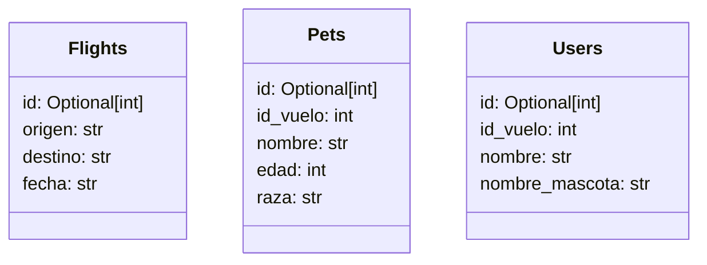

# 🐾 PARCIAL FINAL

> **Jueves, 12 de Junio, 2025**

## 📖 Descripción

**Enunciado** Bienvenido al equipo sigmotoa dev, una empresa con presencia en varios países y diversidad de clientes. En esta ocasión se ha asignado el proyecto "sigmotoaFligths" un desarrollo en asociación con una de las aereolínea que pretende llevar mascotas en vuelos. Se ha solicitado construir un desarrollo funcional que permita a los usuarios reservar y comprar vuelos en los que sus mascotas son lo principal. Cualquier usuario debe poder conectarse al sistema, ver vuelos disponibles y hacer reservas para viajar con su mascota y finalizar la compra. También se debe poder consultar la cantidad de mascotas que ya tienen un boleto comprado en un vuelo.

## ✨ Características Principales

- 🏠 **Identidad del desarrollo en el modelo web**
- 📱 **Desplegable**
- 🖼️ **Diagrama de casos de uso y clases**
- 🗃️ **Registro de usuaios**
- 🐕 **Registro de mascotas**
- 🔄 **Gestiones de usuario y mascotas**
- 📊 **Conexión a bases de datos**
- 🗂️️ **Repositorio GitHUb**

## ✨ Modelado de las entidades 📚

## ✨ Diagrama de casos de uso 🗒️

### Casos de Uso📊
1. **Gestionar Vuelos ✈️**:
   - Crear vuelo.
   - Consultar vuelos.
   - Consultar vuelo específico.
   - Actualizar vuelo.
   - Eliminar vuelo.

2. **Gestionar Mascotas 🐶**:
   - Crear mascota asociada a un vuelo.
   - Consultar mascotas.
   - Consultar mascota específica.
   - Actualizar datos de una mascota.
   - Eliminar mascota.
   - 
3. **Gestionar Usuarios 👥**:
   - Crear usuario.
   - Consultar usuarios.
   - Consultar usuario específica.
   - Actualizar usuario.
   - Eliminar usuario.
     
  **Este diseño de casos de uso** organiza la funcionalidad del sistema en relación con la gestión de vuelos, mascotas y usuarios. Cada operación está diseñada para garantizar la conexión entre las entidades principales del sistema, manteniendo la trazabilidad entre los vuelos y las entidades relacionadas (usuarios y mascotas).
  
## ✨ Diagrama de clases 🗒📋
**✈️ Diagrama de vuelos ✈️**

**🐶 Diagrama de mascotas 🐶**

**👥 Diagrama de usuarios 👥**

  

## ✨ Desarrollo ✨

- **Etapa 1: Configuración Inicial**
    - Configuración del entorno virtual (`.venv`).
    - Registro de dependencias y variables de entorno (`requirements.txt`, `.env`).

- **Etapa 2: Modelado y Base de Datos**
    - Creación de los modelos base para vuelos, mascotas y usuarios en SQLAlchemy/SQLModel.
    - Configuración del archivo `connection_db.py` para manejar la conexión a la base de datos.
    - Carga inicial de datos utilizando los scripts `*_to_db.py` desde los archivos CSV.

- **Etapa 3: Operaciones CRUD**
    - Implementación de la lógica base para las operaciones CRUD en vuelos, mascotas y usuarios:
        - Crear nuevos registros para cada entidad.
        - Consultar individuales o listados.
        - Modificar datos existentes.
        - Eliminar registros.

- **Etapa 4: Interfaz (Frontend)**
    - Construcción de plantillas base (`base.html`) y personalizadas (`home.html`) para permitir la interacción del usuario con el sistema.

- **Etapa 5: Documentación y Control de Versiones**
    - Creación de un archivo `.gitignore` para excluir procesos sensibles.
    - Documentación detallada mediante un `README.md` que describe la estructura del proyecto, los pasos de configuración y los casos de uso.
 
## ✨ Sistema de funcionamiento ✨

- **Modelos**:
    - `flights_models.py`: Define el esquema y los atributos relacionados con los vuelos, incluyendo origen, destino y fecha.
    - `pets_models.py`: Contiene el esquema y atributos de las mascotas, como edad, raza y nombre.
    - `users_models.py`: Gestiona los usuarios y su relación con los vuelos y mascotas vinculadas.

- **Operaciones CRUD**:
    - `flights_operations.py`: Contiene las funciones para operar sobre vuelos, como creación, consulta, actualización y eliminación.
    - `pets_operations.py`: Permite realizar modificaciones y consultas relacionadas con las mascotas.
    - `users_operations.py`: Maneja las operaciones del modelo de usuarios.

- **Base de datos**:
    - `connection_db.py` gestiona la conexión a la base de datos mediante SQLAlchemy/SQLModel.
    - Los scripts `flights_to_db.py`, `pets_to_db.py` y `users_to_db.py` ofrecen una forma estructurada de cargar datos iniciales desde archivos CSV al sistema.

## 🌐 Para ver el despliege puedes ir a los siguientes enlaces

- Repositorio: https://github.com/JuanLozanooo/ParcialFinal.git
- Despligue: https://parcialfinal-s68k.onrender.com

## 👤 Autores

**Danna Valentina Martinez Sanchez 67001335**

**Juan David Lozano Reyes 67001258**
